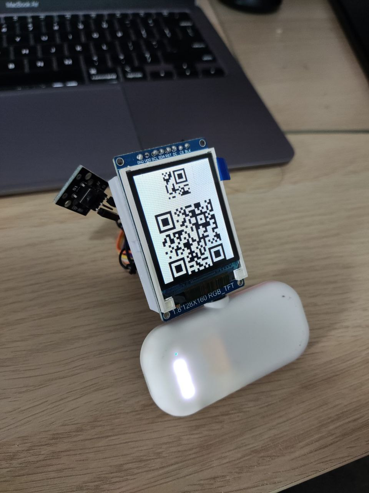

# QR code re-creator and display

This repository contains 2 parts, 1. Python script to convert a QR code image into a digital matrix 2. Firmware for ESP32 + ST7789 Display to display the digital matrix. It is quick 3 hour weekend project for a specific usecase!

## QR Code re-creator `scripts/recreate_qr_from_image.py`

This python script scans an image of a QR code and converts into a digital matrix of 1's (black) and 0's (white). It has 2 primary functions.

1. `image_to_qr` - Scans an image of a QR code and converts into a digital matrix.
2. `matrix_to_qr` - Re-creates the digital matrix into a high def QR code.
   If you have a digital matrix of the QR code already, skip this script.

### How to Run

1. Pip install PIL and numpy
2. Edit `image_path` and `grid_size` in the script
3. Run `python3 scripts/recreate_qr_from_image.py`

## QR Code Display

This is the ESP32 Firmware used to display the QR code on the ST7789 screen. It also has a push button to scroll through multiple QR codes. It is based as a PlatformIO project

### Pin Mapping

| **Component**     | **Pin Connection** |
|-------------------|--------------------|
| **ST7789**        |                    |
| GND               | GND                |
| VDD               | 3.3V               |
| SCL               | 18                 |
| SDA               | 23                 |
| RST               | 26                 |
| DC                | 25                 |
| CS                | 5                  |
| BLK               | 3.3V               |
| **Push Button**   |                    |
| Vin               | 2                  |

### How to Run

1. Import as a platform IO project
2. Edit the QR code binary matrixes and the `drawQRCodes` and `qrCodeLoop` functions depending on usecase.
3. Build and Upload
